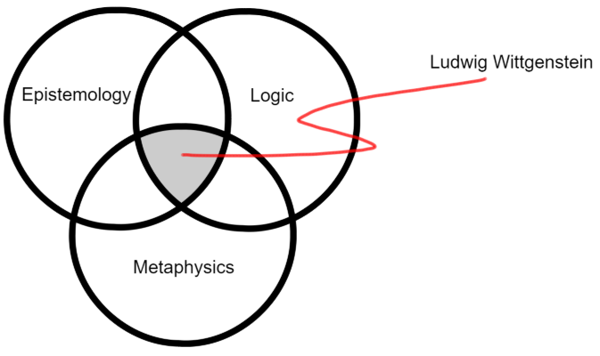
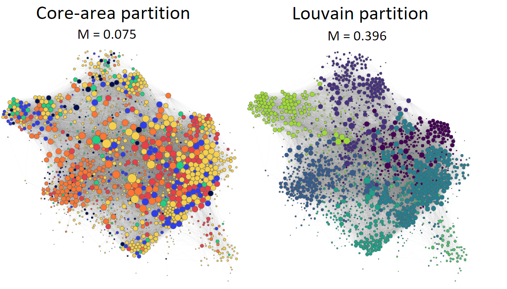

# comsocsci2021group3
<!--<iframe align=middle id="serviceFrameSend" width="100%" height="800" frameborder="0" src="network/complete/index.html"></iframe>-->

### Why Philosophy?
The following will be a deep dive into the realm of Philosophy. The curious adolescent minds of students are often intrigued by the endless void that is philosophy. From the abstract (but logical) language games of Wittgenstein to the rigorous logic and wittiness of his mentor Bertrand Russell. From the ambitious ethical duties of Immanuel Kant to the computational proxies of Jeremy Bentham and John Stuart Mill (and perhaps beyond good and evil with Friedrich Nietzsche). Perhaps one is going through an existential crisis and seek refuge in the works of Albert Camus or Sartre. Perhaps one turns to the stoics for inspirational quotes to scribble on the wall of one’s start-up garage-office while micro-dosing LSD, honing the art of Brazilian Jiu Jitsu and filming a-day-in-the-life-of-an-entrepreneur for one’s YouTube channel. Whatever the reason may be, one thing remains a challenge for one’s philosophical endeavors: time – hence why philosophy is a void. The endless hours needed to get a decent overview of all of philosophy exceeds one human life, perhaps even hundreds (maybe thousands). Consequently, with the help of Wikipedia, some network theory, and some computational semantics we strive to create just that. The project revolves around creating a network of Philosophy using data from Wikipedia. The project also strives to be accessible to non-scientific readers. 

### How data is gathered
The data is gathered using the Python wrapper for Wikipedia’s API, _Wikipedia-API 0.5.4._ Using the API, first every hyperlink in the four lists of philosophers provided on the Wikipedia page _"Lists of philosophers"_ on Wikipedia under the subsection _"Lists of philosophers by name"_ [https://en.wikipedia.org/wiki/Lists_of_philosophers] was extracted and the used for gathering data for each **English** Wikipedia page corresponding to these hyperlinks. Following variables were scraped for each Wikipedia page (if possible); title of the page, content (text), URL (to keep origin) and links (outgoing Wikipedia hyperlinks). All of these variables are all in string format.

As other hyperlinks that those associated with philosophers was gathered, further cleaning was needed. By looking at the data, it was assumed that every hyperlink containing the following words _"Index", "ISBN", "List", "Encyclopedia"_ could be removed right away, and further into the analysis other observation such as 
_"The Oxford Companion to Philosophy", "Timaeus of Locri Glossary of philosophy"_ and _"The Cambridge Dictionary of Philosophy"_ was removed. After this cleaning process, we end up having 1726 observations.

As the project developed, more attributes were gathered as they could provide useful information for the analysis. Using another Wikipedia API, _wptools_, all the _infoboxes_, which is provided often on a Wikipedia page, were collected as they contain fundamental facts about the philosopher. Following the guidelines for infoboxes, _birth_dates_ where extracted using simple string processing. Having around 60% of the philosophers _birth_dates_ in place, further data about this was added using a list of birth years provided by Sune Lehmann [https://raw.githubusercontent.com/suneman/socialgraphs2017/master/files/philosopher_birth_year.json], making the completeness of this attribute close to perfect. The rest was filled in manually by looking the philosopher up on the Internet (mostly Wikipedia).
 
[Something about pageview]![image]

### Initial Graph
#### To be or not to be.. directed or undirected
As we wish to get a nice overview of the Philosophy Network, we must consider whether the network should be directed or undirected. The case for making the network directed is that we preserve the integrity of the Wikipedia link structure. Hyperlinks only point one way, and thus a directed graph shows which Philosopher Wikipedia-pages point to others. However, since the number of Philosophers is finite, we also know the incoming links to each Philosopher. On the other hand, the undirected version of the Philosophy Network gives a more general overview of the Wikipedia link structure and makes community detection much easier. For this project we will primarily make use of the directed Philosophy Network except when dealing with community detection (and some other network-tools). The reason for this is that many of our investigations will be less ambiguous and reveal more wrt. Wikipedia.

More precisely, a directed link between a philosopher (A) and a philosopher (B) is created if there is a hyperlink from the Wikipedia page of (A) to the Wikipedia page (B). 

#### Nodes, links and density
Following the above algorithm for links, the Philosophy Network has a total of ??? nodes and ??? links. As seen, we have less nodes than observations because some Philosophers do not point towards others and are not pointed towards. For any graph we can describe appertaining density as the number of actual links over the number possible links. For a directed graph we have the following equation:

\[Density = \frac{|E|}{|E|(|E|-1)} = ???\]

where |E| denotes the number of links. As seen, the network is very sparse (since the density is closer to 0 than 1) and this is what we expect from real world networks. 
#### Degree (plots log-trans: mean median min max)
Now we turn to the distributions of the node degrees in the network. Since we are working with a directed network we will have both an in- and an out-degree for each Philosopher. Naturally, the sum of the in and out-degrees must be identical since _what goes around comes around_.

<iframe align=middle id="serviceFrameSend" width="100%" height="684" frameborder="0" src="plot1.html"></iframe>

As seen, the average in- and out-degree are the same (what goes around must come around). Since we have log-log transformed the x- and y-axis in the plot, it is apparent that the degree distribution is not normally distributed, but instead is very heavy tailed - meaning that we have some very high degree nodes relative to the averages. In layman terms, this simply means that some philosophers have alot of in and out-going links.

#### Top 5 in/out degree
But who are the top 10 philosophers in terms of in/out-degree? The table below shows exactly that.
<table class="tg">
<thead class="tg">
  <tr class="tg">
    <th class="tg-rz17" colspan="2">Top 10 philosophers (in-degree)</th>
    <th class="tg-rz17" colspan="2">Top 10 philosophers (out-degree)</th>
  </tr>
</thead>
<tbody class="tg">
  <tr class="tg">
    <td class="tg-nnys">Aristotle</td>
    <td class="tg-nnys">535</td>
    <td class="tg-nnys">Plato</td>
    <td class="tg-nnys">379</td>
  </tr>
  <tr class="tg">
    <td class="tg-nnys">Immanuel Kant</td>
    <td class="tg-nnys">530</td>
    <td class="tg-nnys">Immanuel Kant</td>
    <td class="tg-nnys">370</td>
  </tr>
  <tr class="tg">
    <td class="tg-nnys">Plato</td>
    <td class="tg-nnys">438</td>
    <td class="tg-nnys">Baruch Spinoza</td>
    <td class="tg-nnys">348</td>
  </tr>
  <tr class="tg">
    <td class="tg-nnys">Georg Wilhelm Friedrich Hegel</td>
    <td class="tg-nnys">422</td>
    <td class="tg-nnys">Georg Wilhelm Friedrich Hegel</td>
    <td class="tg-nnys">346</td>
  </tr>
  <tr class="tg">
    <td class="tg-nnys">Thomas Aquinas</td>
    <td class="tg-nnys">397</td>
    <td class="tg-nnys">Augustine of Hippo</td>
    <td class="tg-nnys">338</td>
  </tr>
  <tr class="tg">
    <td class="tg-nnys">David Hume</td>
    <td class="tg-nnys">390</td>
    <td class="tg-nnys">Friedrich Nietzsche</td>
    <td class="tg-nnys">331</td>
  </tr>
  <tr class="tg">
    <td class="tg-nnys">Augustine of Hippo</td>
    <td class="tg-nnys">384</td>
    <td class="tg-nnys">David Hume</td>
    <td class="tg-nnys">329</td>
  </tr>
  <tr class="tg">
    <td class="tg-nnys">Friedrich Nietzsche</td>
    <td class="tg-nnys">366</td>
    <td class="tg-nnys">Bertrand Russell</td>
    <td class="tg-nnys">314</td>
  </tr>
  <tr class="tg">
    <td class="tg-nnys">Karl Marx</td>
    <td class="tg-nnys">362</td>
    <td class="tg-nnys">Aristotle</td>
    <td class="tg-nnys">309</td>
  </tr>
  <tr class="tg">
    <td class="tg-nnys">Bertrand Russell</td>
    <td class="tg-nnys">358</td>
    <td class="tg-nnys">Gottfried Leibniz</td>
    <td class="tg-nnys">296</td>
  </tr>
</tbody>
</table>

As seen, all of the philosophers seen in the table are well-known seminal figures of Philosophy. To remind to the reader, remember that in-degree reveals how many links from other philosophers point to the philosopher in question while out-degree reveals how many philosophers the philosopher in question points towards (on Wikipedia). It is thus unsuprising that we see the top 10 philosophers above since they seminal figures of Philosophy, and we would expect them to be either linked to from many other philosophers' Wikipedia pages, or link to other philosophers' Wikipedia pages. 

#### Scatterplot (in out correlation)
Continuing on the last point made above, we now investigate if there a correlation between the in- and out-degree for philosophers.

<iframe align=middle id="serviceFrameSend" width=700 height=1100 frameborder="0" src="plot2.html"></iframe>

The above plot shows the respective in- and out-degrees for each Philosopher. As seen, there is a general positive correlation between the degrees, meaning that we expect (on average) a philosophers' in-degree to reveal something about the appertaining out-degree - namely that philosophers with high in-degree also have high out-degree, and low in-degree philosophers have low out-degree. 

### Initial text 
Our main goal with the following text analysis is to utilize NLP tools that we have learned throughout the course to get an deeper insight about the content in the different philosopher body text as well as the larger corpuses based on known core-areas and the interpreted ones based on network connections. Using different methods such as term-frequency (TF), term frequency–inverse document frequency (TF-IDF) and WordClouds (WC), we want to find out how well we are able to describe each philosopher as well as categorized documents and discuss whether the result was expected or not. Furthermore, this could contribute to the investigation of whether our split seems meaningful or not.

#### Cleaning
Before abovementioned tools can be utilized, a tokenization (separate each word from each other) of the individual philosophers content-variable is performed using Natural Language Tool Kit's (NLTK)  `word_tokenize` followed by a cleaning procedure using regular expression (regex). Using this, following has been cleaned out to the best of our ability;
- Punctuation
- Stopwords using NLTK's `nltk.corpus.stopwords.words('english')`, which is sufficient as the corpus is in English
- Numbers
- "'s" as these aren't removed above
- Names of philosophers based on our page-titles
Note that further into the text analysis, we stem every token using the `SnowballStemmer` from the NLTK library. However, this is only done for the examining the lexical diversity. The reasoning for this choice is that we got the most sensible results for interpreting the documents without stemming, and that lexical diversity is best described using stemmed words.

#### TF-IDF
The aim of the Term frequency - Inverse document frequency metric is to reflect the importance of a term in the document, wighting it according to the whole corpus that the document is a part of. Essentially, a high frequency of the term will give it a higher value, while the IDF will reduce it's value relative to how often appears in the rest of the corpus. Therefore, the formular is as simple as:

$\operatorname{idf}(t,d,D) = \operatorname{tf}(t,d) \cdot \operatorname{idf}(t,D)$

While there are many ways to calculate the TF, we have chosen to simply use the raw count of the particular word - the number of time it appears in the document. The reasoning for this is simply that it will work well mathematically when we want to weight words in the WordClouds later. The math behind the IDF is only a bit more complicated as it has the following formular:

$\operatorname{idf}(t, D)=\log \frac{N}{&#124\{d \in D: t \in d\}&#124}$

where $N=|D|$ i.e. the number of documents in the corpus, and $|\{d \in D: t \in d\}|$ is the number of documents in the corpus in which _t_ appears. To get a full overview of the most frequent terms or highest TF-IDF score for each philosopher and core-area, we refer to the notebook. Based on the TF and TF-IDF measures, we have constructed several WordCloud's which for now will be our center of attention. 

LOREM IPSUM
#### Sentiment Analisys
LOREM IPSUM
#### Lexical Diversity
LOREM IPSUM 

#### WikiPedia page count
LOREM IPSUM 
#### Content
LOREM IPSUM

### Deeper Analisys (not sure yet)
#### Betweenness centrality 
Another interesting investigation in the philosophy network is to compute the betweenness centrality of nodes. In this definition of centrality (and there are many definitions!) nodes that occur in many shortest paths are considered central in the graph and thus have high centrality scores.

An intuitive way of thinking about betweenness centrality score is to consider the consumer airline network, specifically flight logistics. Imagine you live in Denmark and you are trying to book a flight from Copenhagen to a tiny island off the coast of Africa. How would your flight route look? You probably would not fly directly to the island since such a route (path) does not exist. On the other hand, your itinerary would probably not involve having you fly to Russia or the USA for a layover either. The most efficient route (i.e., the shortest path) would probably include a layover in a popular airport in Europe, like Amsterdam, and/or a layover in an airport closer to your destination, like Dubai. Big airports enable many possible flight routes, i.e., the shortest paths, and are very central to the consumer airline network and thus have high betweenness centrality.

For our philosopher network, the centrality betweenness becomes slightly more abstract, as links are now not flight routes but rather hyperlinks between Wikipedia pages. It does however still indicate the most central philosophers in the graph. The table below shows the most central philosophers in the directed philosophy network based on betweenness centrality.

<table class="tg">
<thead>
  <tr>
    <th class="tg-rz17" colspan="2">Top 10 philosophers (betweenness centrality)</th>
  </tr>
</thead>
<tbody>
  <tr>
    <td class="tg-nnys">Immanuel Kant</td>
    <td class="tg-nnys">0.044</td>
  </tr>
  <tr>
    <td class="tg-nnys">Aristotle</td>
    <td class="tg-nnys">0.043</td>
  </tr>
  <tr>
    <td class="tg-nnys">Plato</td>
    <td class="tg-nnys">0.037</td>
  </tr>
  <tr>
    <td class="tg-nnys">Georg Wilhelm Friedrich Hegel</td>
    <td class="tg-nnys">0.028</td>
  </tr>
  <tr>
    <td class="tg-nnys">Bertrand Russell</td>
    <td class="tg-nnys">0.024</td>
  </tr>
  <tr>
    <td class="tg-nnys">Friedrich Nietzsche</td>
    <td class="tg-nnys">0.023</td>
  </tr>
  <tr>
    <td class="tg-nnys">René Descartes</td>
    <td class="tg-nnys">0.021</td>
  </tr>
  <tr>
    <td class="tg-nnys">David Hume</td>
    <td class="tg-nnys">0.021</td>
  </tr>
  <tr>
    <td class="tg-nnys">Maimonides</td>
    <td class="tg-nnys">0.020</td>
  </tr>
  <tr>
    <td class="tg-nnys">Karl Marx</td>
    <td class="tg-nnys">0.019</td>
  </tr>
</tbody>
</table>

As seen, many of the above philosophers are the same as you would find in any introductory courses in philosophy. A reader well-versed in philosophy can only agree that the philosophers above are perhaps the biggest key figures in western philosophy. Nevertheless, we will consider the betweenness centrality score a valuable metric (and perhaps the best metric) for determining a philosopher's importance in the subgraphs explored later.

#### Communities
In philosophy there are many branches, and often philosophers will dip their toes into many different core areas. Think of seminal figures such as Immanuel Kant or Aristotle who both explored and influenced almost all branches of philosophy – what is their respective core area? 
One may be temped to say that Immanuel Kant was an ethicist first and foremost, and that Aristotle is impossible to attribute one specific core-area. But we cannot rely on our individual opinions (although they may be correct) when trying to build a proper network via. the Wikipedia data. Luckily, Wikipedia gracefully provides a list of branches and their respective key philosophers which we can utilize in our endeavour. According to Wikipedia, philosophy can be divided into the following branches: 
-	Aestheticians
-	Epistemologists
-	Ethicists
-	Logicians
-	Metaphysicians
-	Social and political philosophers

It would be nice if these branches were already disjoint – meaning that a philosopher could only appear in one of the branch lists. However, in accordance with the points made before, many of the philosophers appear in multiple branches, and only a select few can be directly assigned a core-area based on the provided branch lists. We provide the non-technical reader with the following Venn-diagram to understand the dilemma (using the eclectic Ludwig Wittgenstein as an example): 

As seen, Ludwig Wittgenstein is a member of three philosophical branches according to Wikipedia, and given this ambiguity how should do one choose which branch of philosophy is his main core-area in a meaningful way? Furthermore, some philosophers do not appear in any of the branch lists, and how do we appropriately determine their philosophical core-area? Unfortunately, there is no perfect way of doing this, but one way is to utilize the network structure to create meaningful classifications of philosophical core-areas for those philosophers who do not appear in any branch list, and for those that appear in many and are therefore ambiguous to classify. The process is as follows: 
-	Start by assigning unambiguous philosophers (those who only appear in only one branch of philosophy) their core area. 
-	Next, for each ambiguous philosopher (those who appear in more than one branch of philosophy), iterate over the branches of philosophy the philosopher is apart of. Then count the number of neighbors in each of those branches (if a particular neighbour is a part of more branches, count them both), and finally assign the core-area as being the branch with the most neighbors. 
-	Finally, for all philosophers that do not appear in any branch of philosophy, iterate through neighbors and assign the core area based on a majority vote.  

By now, the reader might have objections to the approach, and we shall discuss both the assumptions and the limitation of the method above later. For now, we will continue the investigation by examining the fitness of the core-area partition.

#### Modularity

(It should be noted that the network has been made undirected for the tools of modularity to work)

In order to evaluate the core-area partition of the graph, we would like to introduce a concept to the reader called modularity. Without getting into the mathematical definition, we will briefly describe the concept of modularity in an intuitive way. 
Modularity is a way of evaluating a partition, specifically the strength of the partition/division into communities. For any network we can partition the network into communities (naturally these occur in real networks) and use modularity to investigate the quality of the community structure. For any network made up of one single community we have that M=0. The higher the modularity is for a given partition, the better the community structure. A crude way of giving describing what a good partition entails is that in a good partition the connectedness between communities is sparse but remains high within the communities, meaning that the network only has few connections between communities but many within the respective communities. The reverse is also true, as networks are partitioned in ways that make the connectedness between communities higher, the modularity of the partitions will be lower and can even become negative. Naturally, when determining partitions in the real world one must be cognizant of what the partitions tells us about the network, we are interested in. 

As a small thought experiment, imagine two groups of junior developers that are working on the same project but different specific tasks, which we will call branches, and are led by two senior developers that communicate in order optimize the efficiency of the project work. Apart from the senior developers, the two groups do not communicate with each other, meaning that each junior developer only communicates with other junior developers within their branch of the project. In this setting a partition which groups developers into two categories based on the branch in the company will lead to high modularity - even the optimal partition in this case. However, if we instead partition developers based on whether they are right- or left-handed, we would expect the modularity to be lower unless it just somehow happens that only the two senior developers are left-handed while all the junior developers are right-handed - in that case would result in the same optimal modularity.

Using a called the Louvain algorithm, we can determine the best partition for the philosophy network, i.e. the partition that leads to the highest modularity score. The two graphs below show (left) the best partitioning found using the Louvain algorithm, and (right) the partitioning we created using the branches of philosophy as a baseline. 

As seen, the modularity for the Louvain partition is much higher than the partition we found using our methods. On a brighter note, our partition does seem to have some modularity as some node colors appear to be clustered together in the graph. It can however be a quite unfair evaluation to compare partitions against the Louvain partition as it becomes increasingly difficult to keep a high modularity as the number of edges and links grow. Therefore, using an algorithm that creates suitable random versions of a given partition, we statistically evaluate how likely our computed modularity is under the assumption that it was created randomly.  

To help the reader understand what has been done, we have created a distribution of modularity scores of random networks based on the philosophy network using the core-area partition. The black line indicates the modularity score of the core-area partition. Had the black line laid within the bell-shaped curve, we would not consider the partition to be much different from any random partition of the network using the same branches of philosophy. However, because the black line lays far from the bellshaped part of the distribution, and has a much higher value, we consider the modularity of the core area split very significant – meaning that it is highly unlikely that it happened randomly. Consequently, even though the modularity score of the core-area partition is much lower than the optimal modularity found using the Louvain algorithm, it is still a very good partition of the philosophy network.  

#### Assortativity

(For simplicity, the assortativity is computed on the same undirected networks as the modularity)

Another interesting network measurement is assortativity. In short, assortativity is a measure of how similar neighboring nodes are in a graph, categorized by some metric. The most standard form of assortativity is degree- assortativity which, as the name implies, is a statistical investigation that measures if nodes of the same degree tend to link to each-other. However, we will also use assortativity to investigate whether philosophers of a certain core-area are linked to other philosophers of the same core-area in the philosophy network. To supply the reader with some theoretical grounding, we generally say that a network is highly assortative if its assortativity score close to 1, and highly disassortative if the assortativity score close to -1. 

For the degree of nodes we get a assortativity score of 0.03, while we get a slightly higher assortativity based on the core-areas of 0.09. This simply means that philosphers in the network are more likely to be linked to other philosophers with the same core-area, than they are to be linked to other philosophers of the same degrees. The scores are closer to 0 than to 1, and therefore we would say that we see a _slight_ assortativity for both degree and core-area. However, as with the modularity scores, we can investigate if the measures assortativity scores area significant or not. 

As seen by the distributions above, in both cases, the measure assortativity is significantly different from what we would expect to measure had the philosophy network been randomly linked based on the core-area partitioning. This means that even though the assortativity is low, it is non-neglitable. Therefore we can conclude two things, namely than (1) in both cases the assortativity is significatn, and (2) philosophers tend to link to other philosophers of the same core-area much more than they tend to link to other philosophers with the same degree. 

#### Branches of philosophy and centrality

For each branch of philosophy, we create a subgraph by utilizing both the determined core-area and the original branches of philosophy, such that we acoount for both philosophers which previously did not have any core area, and philosophers which are apart of many branches. Since we now wish to create meaningful subgraphs, if a philosopher is a part of many branches, the philosopher will appear in all of the appertaining philosophy branch subgraphs. The reader can essentially think of this as updating the branch of philosophy, after classifying the philosophers using the neighbor-technique described previously, and then creating the subgraphs from the updated branches of philosophy. Thus we have kept the underlying integrity of the original branches of philosophy. 

To remind the reader, the philosopher Ludwig Wittgenstein is a part of three branches of philosophy, namely metaphysics, logic and epistemology. Therefore he will appear in each those subgraphs. Furthermore, next to each subgraph we will list the top 20 philosophers based on betweenness centrality for each branch of philosophy. 

We will provide some brief statistics for the reader to consider while exploring the graphs. Since we have not introduced clustering, the reader can think of this as the tendency for nodes in the graph to cluster together, a low clustering coefficient means that the network essentially does not cluster, and a high clustering coefficient means the opposite. The purity measure is the most interesting for the reader to consider while exploring the graphs. The purity score is a measurement of how many philosophers in the given subgraph has a core-area, determined by our previously mentioned algorithm, equivalent to the subgraph branch. Finally, we have included the statistic Bias, which is a very loaded term. It is basically a measurement of how the size of the different branches of philosophy as changed under the assumption that they should remain unchanged in their respective proportions when classifying new philosophers. Naturally, this is harsh assumption, and perhaps in reality we would not expect the branches of philosophy to grow in accordance with their original proportionality on Wikipedia. It does however still tell us how the respective branch-proportionalities have changed after implementing our core-area algorithm. 

<table>
<thead>
  <tr>
    <th>Branches</th>
    <th>Size</th>
    <th>Density</th>
    <th>Clustering</th>
    <th>Purity</th>
    <th>Bias</th>
  </tr>
</thead>
<tbody>
  <tr>
    <td>sociopoliticals</td>
    <td>998</td>
    <td>0.032</td>
    <td>0.488</td>
    <td>0.873</td>
    <td>1.465</td>
  </tr>
  <tr>
    <td>metaphysicians</td>
    <td>395</td>
    <td>0.105</td>
    <td>0.588</td>
    <td>0.263</td>
    <td>1.160</td>
  </tr>
  <tr>
    <td>logicians</td>
    <td>252</td>
    <td>0.097</td>
    <td>0.546</td>
    <td>0.401</td>
    <td>0.555</td>
  </tr>
  <tr>
    <td>epistemologists</td>
    <td>313</td>
    <td>0.153</td>
    <td>0.635</td>
    <td>0.744</td>
    <td>1.353</td>
  </tr>
  <tr>
    <td>aestheticians</td>
    <td>169</td>
    <td>0.141</td>
    <td>0.610</td>
    <td>0.929</td>
    <td>0.896</td>
  </tr>
  <tr>
    <td>ethicists</td>
    <td>312</td>
    <td>0.112</td>
    <td>0.594</td>
    <td>0.497</td>
    <td>0.574</td>
  </tr>
</tbody>
</table>

The following will not be much more than a picture book for the curious reader to explore. As the reader will notice, some core philosophers will change based on the subgraph examined, and some philosophers will appear in many graphs. We encourage the reader to spend some time exploring on their own. 

        <button onclick="location.href = 'network/sociopoliticals/index.html';" class="button" style="min-width: 200px; height: 200px; background-color: #F6D04D">
        	Sociopoliticals
        </button>
        <button onclick="location.href = 'network/metaphysicians/index.html';" class="button" style="min-width: 180px; height: 180px; background-color: #1FD082">
        	Metaphysicians
        </button>
        <button onclick="location.href = 'network/logicians/index.html';" class="button" style="min-width: 130px; height: 130px; background-color: #030F4F">
        	Logicians
        </button>
        <button onclick="location.href = 'network/epistemologists/index.html';" class="button" style="min-width: 160px; height: 160px; background-color: #FC7634">
        	Epistemologists
        </button>
        <button onclick="location.href = 'network/aestheticians/index.html';" class="button" style="min-width: 130px; height: 130px; background-color: #E83F48">
        	Aestheticians
        </button>
        <button onclick="location.href = 'network/ethicists/index.html';" class="button" style="min-width: 160px; height: 160px; background-color: #2F3EEA">
        	Ethicists
        </button>

#### Some advanced investigations and discussions
Small world property, Clustering, Betweenness, Assortiveness etc.
#### Branch
#### TF-IDF for communities
#### 

<!--<iframe width="100%" height="764" frameborder="0"
  src="https://observablehq.com/embed/@andersgmadsen/untitled/2?cells=chart"></iframe>-->

# Pitch
<iframe width="1730" height="695" src="https://www.youtube.com/embed/nr-eFXzQNGs" title="YouTube video player" frameborder="0" allow="accelerometer; autoplay; clipboard-write; encrypted-media; gyroscope; picture-in-picture" allowfullscreen></iframe>

